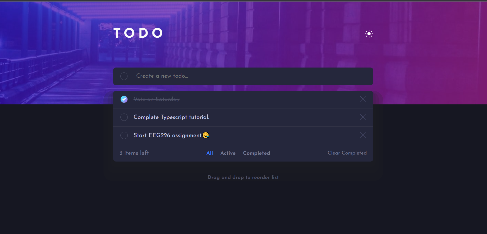

# Frontend Mentor - Todo app solution

This is a solution to the [Todo app challenge on Frontend Mentor](https://www.frontendmentor.io/challenges/todo-app-Su1_KokOW). Frontend Mentor challenges help you improve your coding skills by building realistic projects. 

## Table of contents

- [Overview](#overview)
  - [Features](#features)
  - [Additional Features](#additional-features)
  - [Screenshot](#screenshot)
  - [Links](#links)
- [My process](#my-process)
  - [Built with](#built-with)
  - [What I learned](#what-i-learned)
  - [Useful resources](#useful-resources)
- [Author](#author)

## Overview

### Features

Users can:

- View the optimal layout for the app depending on their device's screen size
- See hover states for all interactive elements on the page
- Add new todos to the list
- Mark todos as complete
- Delete todos from the list
- Filter by all/active/complete todos
- Clear all completed todos
- Toggle light and dark mode
- Drag and drop to reorder items on the list

### Additional features

- Automatically detects and sets the preferred color scheme (light or dark theme)
- All todos are saved to the browser's memory by default

### Screenshot


### Links

- Solution URL: [https://www.frontendmentor.io/solutions/todoapp-8SVWi4zeOq](https://www.frontendmentor.io/solutions/todoapp-8SVWi4zeOq)
- Live Site URL: [https://todoapp-fem.vercel.app](https://todoapp-fem.vercel.app)

## My process

### Built with

- Semantic HTML5 markup
- Flexbox
- Mobile-first workflow
- [React](https://reactjs.org/) - JS library
- [react-beautiful-dnd](https://react-beautiful-dnd.netlify.com/) - React drag and drop library
- [styled-components](https://styled-components.com/) - For styles

### What I learned


```css (using styled-components)
    /*
      Creates a rounded border gradient in the shape of a hollow circle 
      (when the checkbox input is hovered)
    */
    ${({ theme, $completed }) => !$completed && `
        border: ${theme.isDarkMode ? '.015em' : '.125em'} double transparent;
        background-image: linear-gradient(
            ${theme.isDarkMode ? theme.colors.dark.veryDarkDesaturatedBlue : theme.colors.light.veryLightGray}, 
            ${theme.isDarkMode ? theme.colors.dark.veryDarkDesaturatedBlue : theme.colors.light.veryLightGray}),
            ${theme.colors.checkBackground};
        background-origin: border-box;
        background-clip: padding-box, border-box;
        padding: .25em;
    `}
```
### Useful resources

- [Adding drag-and-drop functionality with react-beautiful-dnd](https://blog.logrocket.com/adding-drag-and-drop-functionality-with-react-beautiful-dnd/) - This article helped me understand how to add basic drag-and-drop functionality using [react-beautiful-dnd](https://react-beautiful-dnd.netlify.com/).
- [Customizing checkbox inputs](https://moderncss.dev/pure-css-custom-checkbox-style) - This is a great resource which helped me customize checkbox inputs in a responsive and accessible manner. I'd recommend it to anyone still learning this concept.

## Author

- Website - [Ayobami Tunwase](https://github.com/ayobami11)
- Frontend Mentor - [@ayobami11](https://www.frontendmentor.io/profile/ayobami11)
- Twitter - [@TunwaseAyobami](https://www.twitter.com/@TunwaseAyobami)